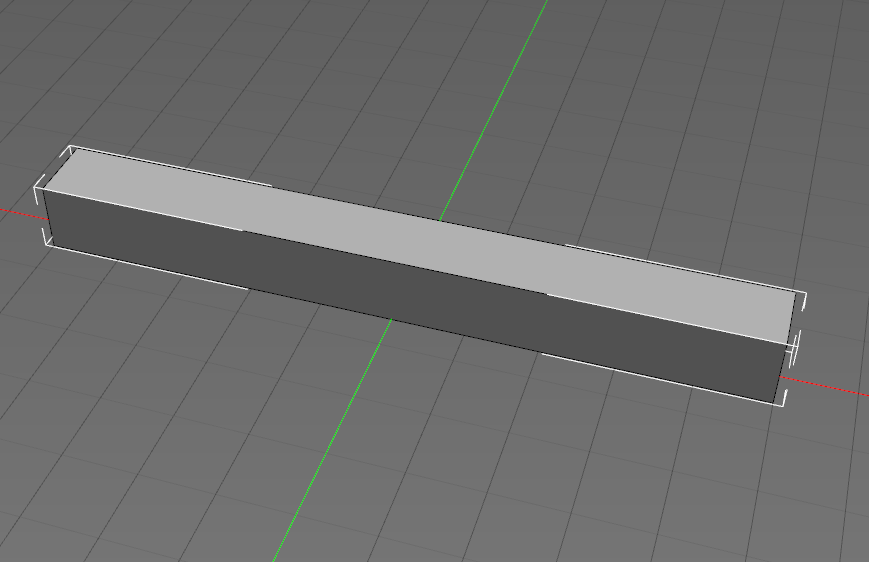
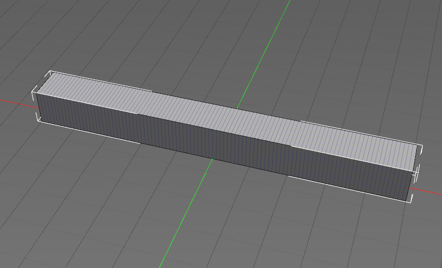
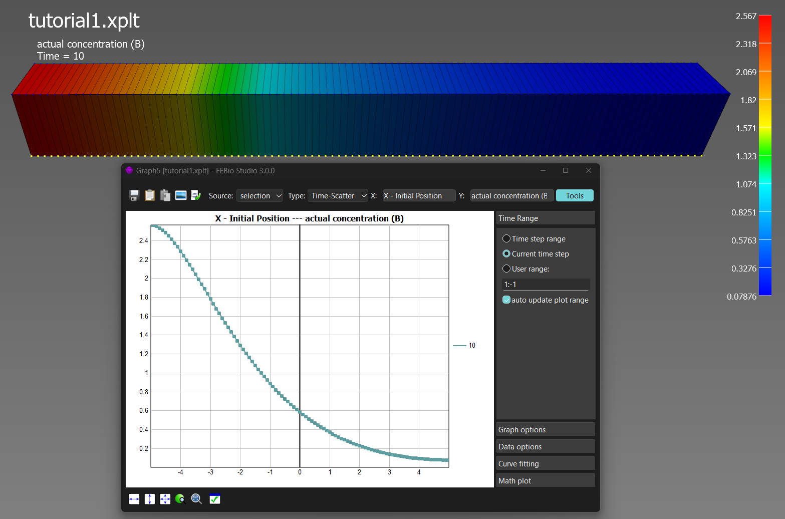

# Tutorial 1

In this first tutorial, we'll solve a simple 1D reaction-diffusion problem, where two species, $A$ and $B$, react via the equation. 

\[A \to B\]

The domain will consist of a block of size $10 \times 1 \times 1$ block. On the left face of the block, a concentration flux of species A will be defined. Both species will be allowed to diffuse. 

## Prerequisites
We'll use the FEBioChem plugin in FEBio Studio. Before we can proceed, make sure that you have FEBio Studio (version 3.0 or above) installed on your computer. 

Next, you'll need to install the FEBioChem plugin. This can be done using the Plugin Repository in FEBio Studio. To open the Plugin Repository, use the menu **FEBio** →
 **Plugin Repository**.

Locate the FEBioChem plugin in the list on the left side and click the **Download Plugin** button.

This will download and install the plugin.

This tutorial will assume some familiarity with FEBioStudio already. If you are completely new to the software, it is advised to start with the introductory tutorials available on the [FEBio Knowledgebase](https://febio.org/knowledgebase/). 

## Model Setup
### Starting a new model
Create a new model using the menu **File** → **New Model...**. From the dialog box that appears, select the _reaction-diffusion_ option. Then click OK. 

### Creating geometry and mesh
Select the **Create** tab on the **Build** panel and click the Box item. For the parameters, choose,

* `Width` : 10
* `Height` : 1
* `Depth` : 1
 
 Then click the _Create_ button. This will create a box of the specified dimensions. The box should appear on the screen. 

 

Next, click the **Mesh** tab on the **Build** panel. Set the following parameters.

* `Nx` : 100
* `Ny` : 1
* `Nz` : 1

Leave all other parameters at their default values. Next, click _Apply_. 

!!! Note
    Note that we want to solve a 1D problem in this tutorial, but FEBio doesn't support true 1D analyses. FEBio only supports 3D analyses, which is why we create this 3D box. By using unit dimensions in $y$ and $z$ and using only single elements along $x$ we'll be able to emulate a 1D analysis. 

### Creating the material
First, we need to define the two species. Use the menu **Physics** → **Solute Table** to open the Solute Table dialog box. (FEBio usually refers to _solutes_ instead of _species_, but in this case the distinction is not relevant). In this dialog box, click the _Add_ button to a new species. Double-click the item under _Name_ to edit the name. Change it to **A**. Do the same thing to create species **B**. 

Next, use the menu **Physics** → **New Material...** to open the _Material_ dialog box. Select the _reaction-diffusion_ option and click OK. A new (empty) material will appear in the model tree. 

Select the value of the `species` property and change it to 2. Two new entries appear under the species property. Select the value of the first species entry, and from the drop-down menu select the `<select>` option. From the dialog box that appears, choose _Species_. New parameters will appear under the _species-1_ item in the model tree. Set the following parameters:

* `name`: select **A** from the dropdown box
* `diffusivity` : 1

Repeat the process for the _species-2_, but this time choose **B** for the species name. 

Next, we'll add the reaction. Select the value of the `reaction` property and set it to 1. This adds one reaction to the material. 

Then, select the value of _reaction-1_ and choose `<select>` from the dropdown. In the dialog box that appears, choose _Mass Action_. Click OK. 

This creates a reaction that follows the law of Mass Action. This reaction requires the following parameters:

* `rate_constant` : 1
* `equation` : `"A-->B"`

This completes the definition of the material. 

Finally, we need to assign this material to the box. First select the box by clicking on it in the Graphics View. A white bounding box should appear around the box to indicate that it is selected. To assign the material to the box, click the green plus button in the **Selection** pane of the **Model** panel, below the properties list. If the assignment was successful, the box will be colored with the same color that is assigned of the material.

### Boundary Conditions

We'll apply only one boundary condition, namely an initial concentration flux for species A. Use the menu  **Physics** → **Add Surface Load...** to open the _Add Surface Load_ dialog box. Select the _concentration flux_ option and click OK. Set the following parameters:

* `flux` : -1
* `solute_id` : 1 (A has solute ID 1 since we created it first. B would have ID 2)

To assign this load to the left face of the box, proceed as follows:

1. Click the face selection button on the main toolbar above the Graphics View. (looks like a blue surface)
2. Click the left face of the box. This is the face perpendicular to the $-x$ axis. (Should be _Surface4_.)
3. Click the green plus button on the _Selection_ panel under the Model tree. (or use **Ctrl+a** shortcut). 

The load will now be applied to the left side of the box. 

### Analysis and solver settings

To complete the model setup, use the menu **Physics** → **Add Analysis Step** to open the _Add Analysis_ dialog box. Just click OK on this dialog box and a new step will be added to the model. 

There are quite a few settings, but for this tutorial, we only need to change a few: 

* `analysis` : `TRANSIENT`
* `time_steps` : 100
* `Auto time stepper` : (none) (To remove it click the `default` value, and select _remove_ from the dropdown list.)

!!! Note
    The auto-time stepper adjusts the time step size automatically depending on how well the model is running. For this simple model it isn't necessary, and removing it simplifies the process of changing time steps or time step sizes.  

### Output settings

We need to decide what we want FEBio to output for our simulation. Right-click on _plotfile_ item under the _Output_ item in the model tree and select **Edit output** from the popup menu. In the dialog box that appears, check the _actual concentration_ and _concentraction flux_ variables. Then click _Save_.

This completes the model setup and we are now ready to run the model. 

!!! tip
    This is also a good time to save the model if you haven't done so yet. 

## Running the tutorial
FEBioChem models can be run in the same way as any other FEBio model. Click the _Run_ button from the main toolbar, or choose the menu **FEBio** → **Run FEBio**.

Make sure to save the model first before you run it. 

The default settings should be fine, but make sure to double-check the working directory. 

Then, click the _Run_ button. 

If all goes well, the model should finish in a few seconds and the **Job Summary** dialog box appears. Click the button _Open Results_ to view the results in FEBio Studio.

## Visualizing the results
There are many things to look at, but let's simply visualize the concentrations for the two species. First, select the `actual concentration (A)` variable from the dropdown list in the main toolbar. This plots the concentration of species A. You can then press the play button or drag the current time step displayed on the **Timeline** panel to view an animation of how the concentration changes over time. Note that it stabilizes after a short time and reaches its max value of 0.952 on the inlet side. The equilibrium is established once the rate of consumption of A (due to the reaction) balances the concentration influx. 

Now plot the `actual concentration (B)`, which displays the concentration of species B. Note that it continues to grow over time and does not stabilize. This is of course to be expected because there are no outflow conditions defined on species B. 

